# How to Locally Debug a ```ASP.Net`` Core Web API that Receives Messages from Azure EventGrid

This tutorial demonstrates how to debug a ```ASP.Net``` Core Web API endpoint that receives messages when a new blob is created in an Azure Blob Storage Account.

For convienience, I am using the Visual Studio Code [Dev Containers](https://code.visualstudio.com/docs/remote/containers) extension.

Aslo, I have created 2 bash scripts to aid in this tutorial.  The scripts are used to create an Azure Storage Account & to delete the Azure Storage Account.  You can find more information about these scripts [here](./scripts)  

## Prerequisites

* An Azure Subscription
* azure-cli
* Docker
* Git
* Visual Studio Code + [Dev Containers](https://code.visualstudio.com/docs/remote/containers)

## Dev Container

Let's open up the code in a Dev Container.  You will want to select the Dev Container icon at the bottom right of the screen & choose *Remote-Containers: Open Folder in Container..* & select this cloned repo root directory, which contains the *.devcontainer* folder.

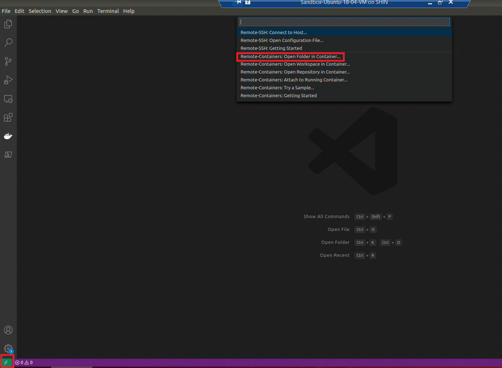

Also, let's use azure-cli to login & set the default subscription:

```bash
    az login && az account set -s {your_azure_subscription}
```

## ngrok

First, we need to donwload a tool called [ngrok](https://ngrok.com/). Once you create an account, following the instructions on how to register your authtoken.

## Register the Azure EventGrid Provider

If not already registered, we will need to [register](https://docs.microsoft.com/en-us/azure/event-grid/custom-event-quickstart#enable-event-grid-resource-provider) the Azure EventGrid. Open up a terminal and run the following command.

```bash
    az provider show --namespace Microsoft.EventGrid --query "registrationState"
```

## Create Azure Blog Storage Account

We will clone the sample application and navigate to the *scripts* folder and execute the following command to create our Azure Blog Storage Account and a Blob container called demo:

```bash
    chmod +x create-az-storage-account.sh &&
    ./create-az-storage-account.sh -r {name_of_resource_group} -l {location} -a {name_of_blob_storage_account}
```

If the script ran successfully, it will return back the message *The script has created the Azure Resources*.

## Debugging

Open up the ASP.Net Core Web API project in Visual Studio Code and press F5 to run the project. A quick note, You will want to run the project under *http* (as opposed to https) to allow ngrok to work.

In the *EventGridController*, place breakpoints in various places to debug the application when a message is received from Azure EventGrid.

Next, we need to run ngrok. We do this by executing the command below: *(note: for Windows user, you need to use the command prompt as I could not get git bash to work)*.

```bash
    # Windows non-wsl users, should be ngrok.exe
    ngrok http -host-header=localhost 5000
```

Next, we will need to copy the generated url so we can use it to subscribe to events via Azure EventGrid.

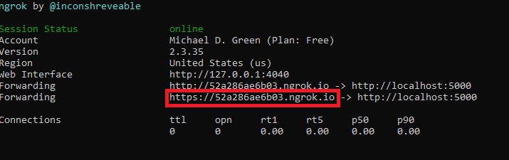

Next, we need to navigate to the [Azure Portal](https://https//portal.azure.com) to create the Subscription and upload a file, so we can debug the application.

In the Azure Portal, we need to find the Azure Blob Storage Account we created when we ran the *create-az-storage-account.sh* bash script. Select "Events" and then "Event Subscription".

For the Endpoint Type, we will choose "webhook" and copy the url ngork generated and add "/api/eventgrid" to the end ie ```https://ngrok-url/api/eventgrid```. See the images below for guidance:

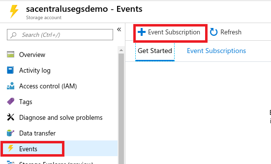

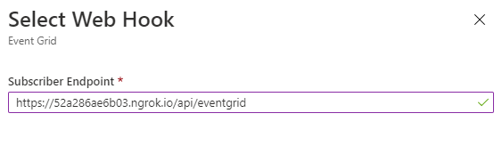

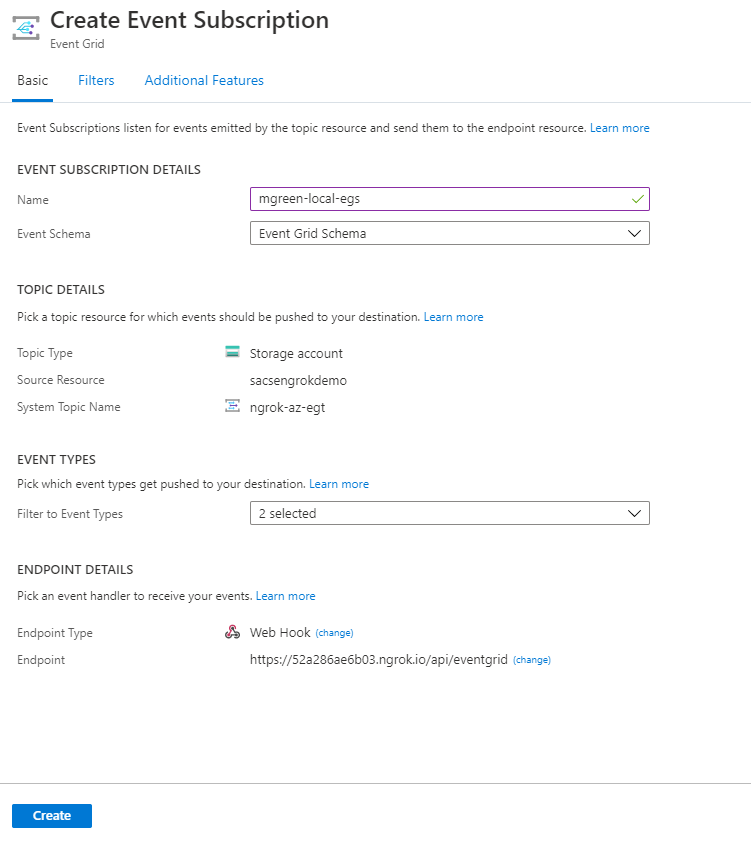

When we hit the *create* button to create the Subscription, for security reasons, Azure EventGrid will validate the endpoint and if you have a breakpoint similar to the picture below, the breakpoint should be activated in Visual Studio Code:

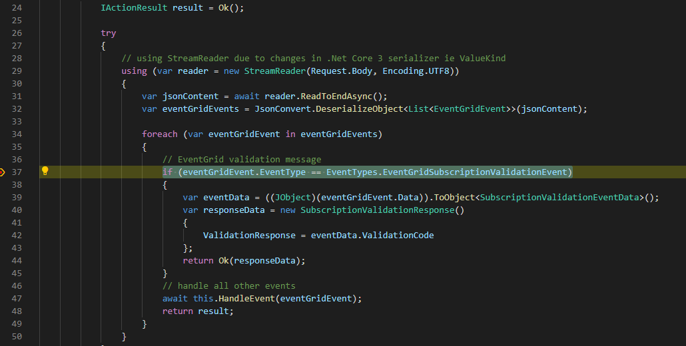

Also, the new Subscription should be displayed on the Events page of the Azure Blob Storage Account:

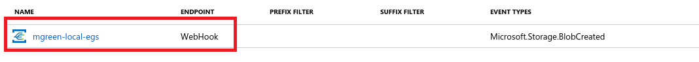

Now let's upload a file and debug the *HandleEventGridEventAsync* Method inside of the EventGridController *(make sure you have a breakpoint in the HandleEventGridEventAsync method)*.

In the Azure Portal, we need to find the Azure Blog Storage Account and navigate to the *demo* container. Inside of the container, we will press the *upload* button. Included in the Git repository root directory is a file called sample.json, you can choose this file or a file of your own choosing. For guidance, see the pictures below:

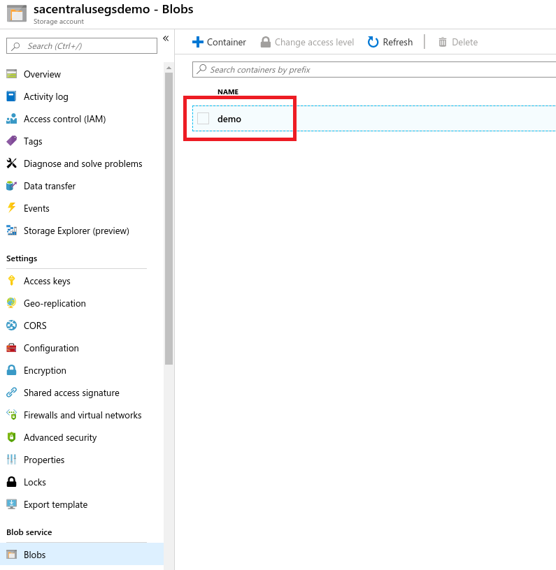

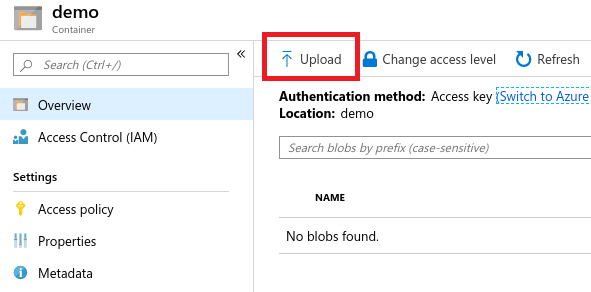

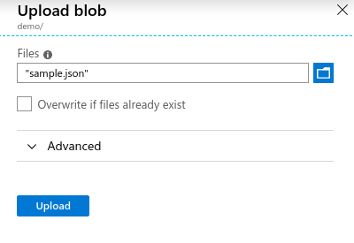

Once the file is finished uploading, our breakpoint should be activated in Visual Studio Code:

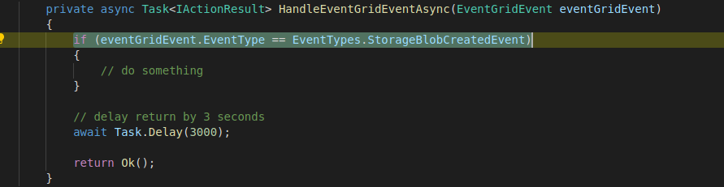

## Clean Up

Now that we are finished, we can run the *delete-az-storage-account.sh* bash script to clean up our resources. Run the following command:

```bash
    chmod +x delete-az-storage-account.sh &&
    ./delete-az-storage-account.sh -r {name_of_resource_group}
```

If the script ran successfully, it will return back the message *The script has deleted the Azure Resources*.
